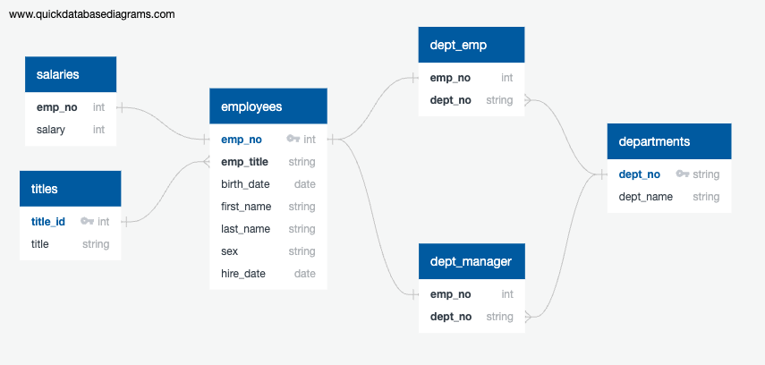
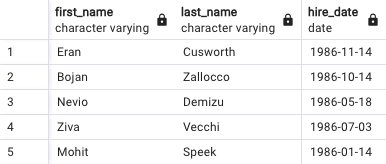

# SQL-Challenge

## Overview
In this challenge, I designed tables in PostgreSQL 16 to hold employee and manager data from Pewlett Hackard (a fictional company). I then used those tables to find specific information about certain employees and departments.

### Part 1: Data Modeling
I created an Entity Relationship Diagram (ERD) of the tables, using QuickDBD:

This ERD outlines the following relationships:
1. One to One between salaries and employees
2. One to Many between titles and employees
3. One to One between employees and department employees
4. One to One between employees and department managers
5. One to Many between departments and department employees
6. One to Many between departments and department managers

### Part 2: Data Engineering
I created a table schema based on the relationships in the ERD above and the data in each of the CSV files. There are six tables: departments, titles, employees, salaries, dept_emp, and dept_manager. To replicate this table schemata, see my code in EmployeeSQL/table_schemata.sql.

### Part 3: Data Analysis
I used queries in SQL to obtain information about employee groups. I created views for each query, which can be found in EmployeeSQL/queries.sql. They hold the following information:
1. employees_info: employee number, last name, first name, sex, and salary

2. employees_1986: first name, last name, and hire date for all employees hired in 1986

3. dept_managers_info: employee number, last name, first name, department number, and department name for each department manager

4. dept_employees_info: employee number, last name, first name, department number, and department name for all department employees

5. hercules_b: first name, last name, and sex of each employee with the first name "Hercules" and a last name starting with "B"

6. sales_employees: employee number, last name, and first name of all employees in the Sales department

7. sales_development_employees: employee number, last name, first name, and department name for all employees in the Sales and Development departments

8. last_names: the frequency counts of employee last names in descending order
